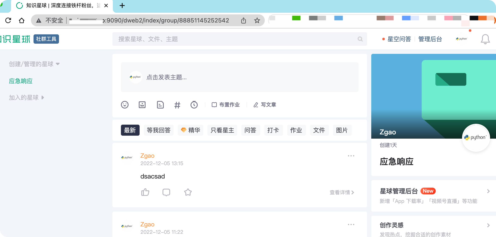
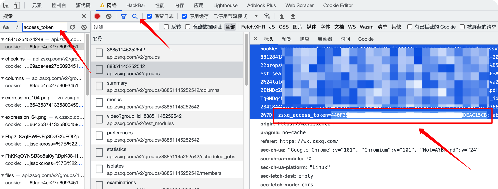

# 🚀知识星球订阅共享
## 本项目为业余练习Nginx配置的demo，请勿用于非法途径！
通过Nginx反向代理的方式访问自己账号下的星球👊


## docker pull 一键搭建
```
docker run  --name zsxq -d -e YOUR_ACCESS_TOKEN="xxxxx" -e YOUR_IP_OR_DOMAIN="xx.xx.xx.xx:9090" -p 9090:80 zgao/zsxq
```
## docker build 本地搭建
```
git clone https://github.com/zgao264/zsxq-share.git
cd zsxq-share/
docker build -t zsxq .
docker run --name zsxq -d -e YOUR_ACCESS_TOKEN="xxxxx" -e YOUR_IP_OR_DOMAIN="xx.xx.xx.xx:9090" -p 9090:80 zsxq
```
YOUR_ACCESS_TOKEN 填你的星球token
YOUR_IP_OR_DOMAIN 填vps的域名或者ip，默认映射端口为9090
### 默认用户密码为zsxq/zsxq

### 修改默认密码
按照下面的命令自行修改
```
docker exec zsxq echo 用户名:"$(openssl passwd 密码)" >./htpasswd.txt
```
### 如何获取获取知识星球token
f12打开浏览器控制台

